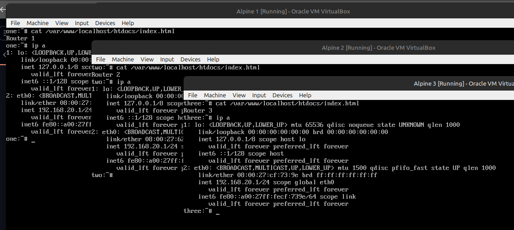
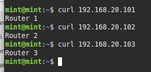

<style>
body { min-width: 50% !important; }
</style>
## The problem

When configuring routers, it would be nice parallelize the work by making changes on several devices at once. However, by default all of the devices use the same IP addresses, so how would you talk to all of them at the same time?

\ 

## Potential solutions

My first thought it to have a setup with several routers, and let each mask their own private instance of the conflicting address space.

This naive approach would work, but has the drawback of physical complexity and requiring a large number of routers.

An evolution of this concept is using network namespaces.
I love network namespaces, I love them so much that I wrote a network topology simulator called [virtopology](https://github.com/h0dgep0dge/virtopology).
Using namespaces trades the physical complexity for some software complexity, but I find the structure very understandable and easy to visualize. 

he drawback of this approach is that it requires a platform that has both enough ports for the devices you want to talk to, and software that supports configuring namespaces.
The only device I have that meets these requirements is a WatchGuard Firebox M4600, not a terribly convenient or pleasant machine to use.
As much as I love Mikrotik, to my knowledge their devices do not support configuring network namespaces.

## The winning solution

To take advantage of my Mikrotik routers and switches with numerous ports, I decided to implement a solution using the features of RouterOS.

The key to this solution is that network routes can be hidden away in their own tables, where they are ignored until they're applied to a particular connection.

Flows can be marked to be governed by a particular routing table by a mangle firewall rule, the destination address rewritten to target the device of interest by a dstnat firewall rule, and finally the source ip address rewritten something the target device knows how to respond to.

## The lab

As I didn't feel like setting up a real router and target devices to test with, I spun up 5 virtual machines. Linux Mint for to run a browser, 3 Alpine Linux to act at the devices being configured, and RouterOS to run the show.

To simulate several identical devices, the Alpine nodes got nearly identical configurations, a static ip of `192.168.20.1/24`, and a web server to identify each one.
The Linux Mint live instance recieved no special configuration, the interface configuring by DHCP.
The RouterOS VM has a separate link to each of the other VMs.

```
                               -------------- 192.168.20.0/24 ------------
                               |            |-----------------| Alpine 1 |
                               |            |                 ------------
-------------- 192.168.88.0/24 |            | 192.168.20.0/24 ------------
| Linux Mint |-----------------|  RouterOS  |-----------------| Alpine 2 |
--------------                 |            |                 ------------
                               |            | 192.168.20.0/24 ------------
                               |            |-----------------| Alpine 3 |
                               --------------                 ------------
```

## The config

For the router to be able to talk to the devices of interest at all, it will need source IP addresses, routing tables for each device, and routes.

```
/ip/address
add address=192.168.20.2 interface=ether2 network=192.168.20.2
add address=192.168.20.2 interface=ether3 network=192.168.20.2
add address=192.168.20.2 interface=ether4 network=192.168.20.2

/routing/table
add disabled=no fib name=router1
add disabled=no fib name=router2
add disabled=no fib name=router3

/ip/route
add disabled=no dst-address=192.168.20.0/24 gateway=ether2 routing-table=router1 supress-hw-offload=no
add disabled=no dst-address=192.168.20.0/24 gateway=ether3 routing-table=router2 supress-hw-offload=no
add disabled=no dst-address=192.168.20.0/24 gateway=ether4 routing-table=router3 supress-hw-offload=no
```

Notice the interfaces are given a single address and not an address part of a subnet, this is to prevent the OS from creating a dynamic route that may mess with the setup, though it shouldn't be necessary in theory because the traffic we're interested in shouldn't ever be looking at the main routing table.

The next thing the router needs is to brand the traffic it wants to forward with the mark of the router it should be forwarded to, or more specifically the mark of the routing table that should be used to route it.

```
/ip/firewall/mangle
add action=mark-routing chain=prerouting dst-address=192.168.20.101 new-routing-mark=router1
add action=mark-routing chain=prerouting dst-address=192.168.20.102 new-routing-mark=router2
add action=mark-routing chain=prerouting dst-address=192.168.20.103 new-routing-mark=router3
```

And further, packets should be destination NATed to the IP address of the device of interest.

```
/ip/firewall/nat
add action=dst-nat chain=dstnat dst-address=192.168.20.0/24 in-interface=ether1 to-address=192.168.20.1
```

Notice all packets are forwarded to the same IP address, however by this point they've already been marked with the routing table they should use, so they continue on with the memory of the specific device they were originally destined for.
A key fact here is that packets are always processed against the mangle table *before* the dstnat table, meaning they already have a routing mark when the destination IP address is changed.

Finally, the packet has been given the appropriate destination IP, has been marked to use the appropriate routing table, but the source IP address is still the one of the original client, but the device of interest may not know where to send packets to get them back to this IP.
This is solved by using a masquerade rule on the outgoing interfaces, which rewrites the source IP address to the one of the outgoing interface itself, on the 192.168.20.0/24 subnet, which the final endpoint will know how to reply to.

```
/ip/firewall/nat
add action=masquerade chain=srcnat out-interface=ether2
add action=masquerade chain=srcnat out-interface=ether3
add action=masquerade chain=srcnat out-interface=ether4
```

## The proof is in the forwarding




:^)